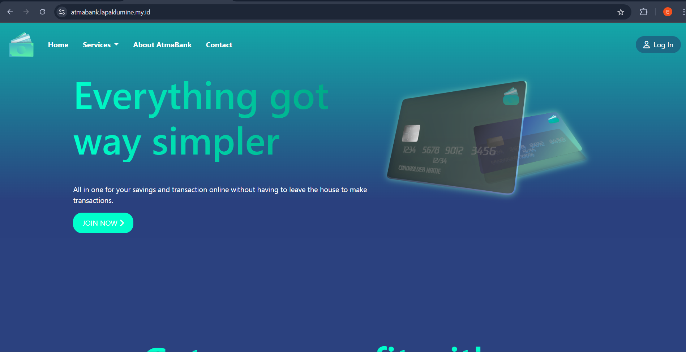

## Atma Bank

 
Designed and developed a responsive website for AtmaBank, featuring seamless transfer and loan functionalities. The platform includes tailored interfaces for Users and Admins, ensuring streamlined operations and an enhanced user experience.

### Group Member :
<ul>
    <li>Edwardy (220711676) - frontend & backend</li>
    <li>Stewart Sidauruk (220711816) - frontend & backend</li>
    <li>Catherine Charissa Oktaviani (220711939) - design frontend & backend</li>
    <li>Tomy (220711936) - frontend & backend</li>
</ul>

### User Interface

### Admin Interface

